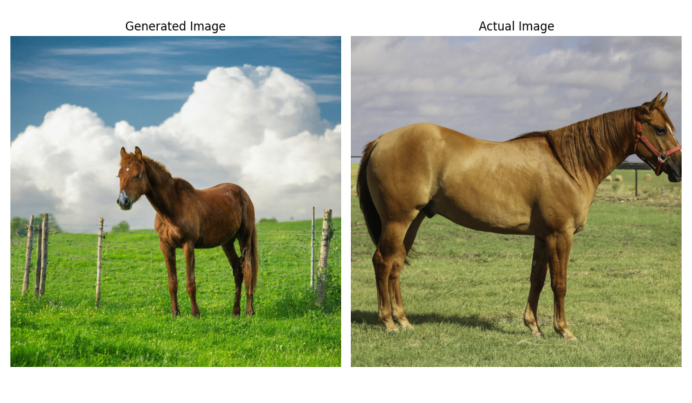
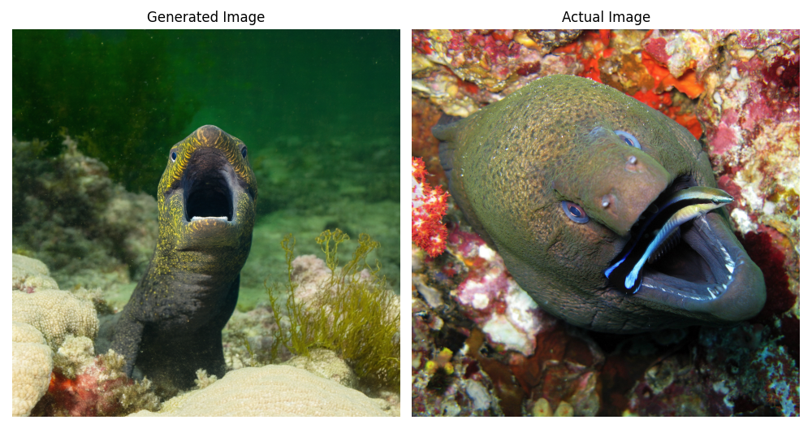

# GenImageClass
This project is all about to train a classifier in order to distinguish if an image is real or fake. We use **Image -> Caption -> Image** and then we use this dataset in order to train various classifiers to distinguish the fake ones!

## TODO List:
- [ ] Add requirements txt or a yaml for conda
- [ ] Add Vscode for standarization (formaters)?
- [ ] Discussion about the Dataset Structure
  

# Preprocess.py

This script iterates over a dataset, and standarizes every image to be 1024*1024

# Florence.py
The florence script is used to parse Actual Images ang generate captions for each one in order to be used later on the reverse process.

# Stable Diffusion.py
The script uses a quantized Stable Diffusion 3.5 model in order to generate "fake" images from the captions similar to the actual ones.

## Examples



# Dataset

```
Dataset
├── Captions
│   └── Train
|
├── Images
|   |
│   ├── Train
|   |   ├── Actual
|   |   └── Generated
|   |
│   └── Validation
|       ├── Actual
|       └── Generated
|
└── Original Dataset
    ├── DIV2K_train_HR
    │   └── DIV2K_train_HR
    └── DIV2K_valid_HR
        └── DIV2K_valid_HR
```
